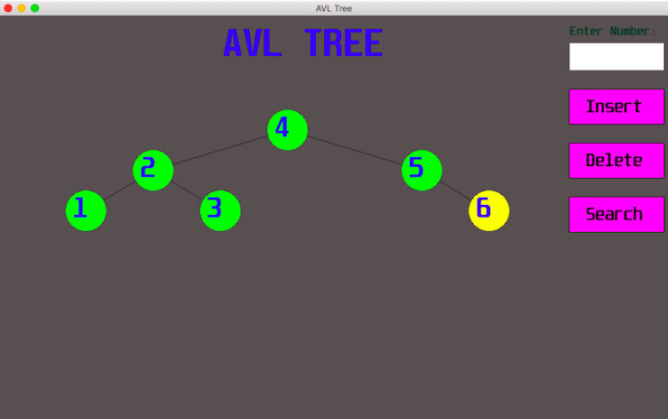

# AVL Tree Visualization

AVL tree implemented using C++ and SFML 2.5.1.

The supported operations are:
- Insertion
- Deletion
- Search

Graphics library used: SFML 2.5.1  
Font used: Unispace font

---
## Issues
Feel free to submit issues and enhancement requests.

---
## Contributing
- Fork this repo on GitHub.
- Clone the fork repository to your own machine.
- Make modifications and commit changes to your own branch.
- Push your work to your fork.
- Submit a pull request.